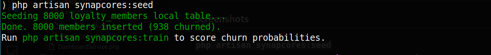
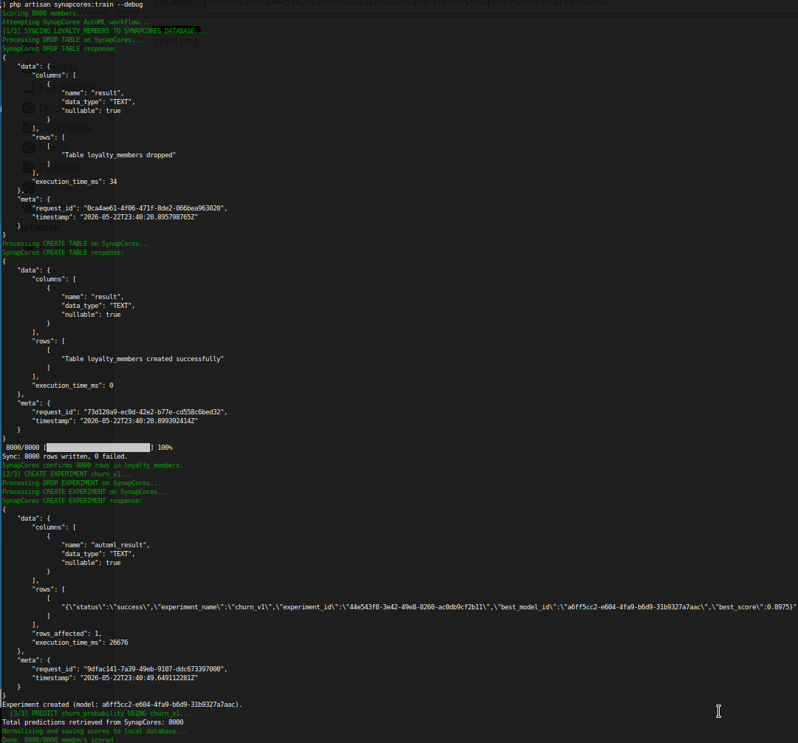
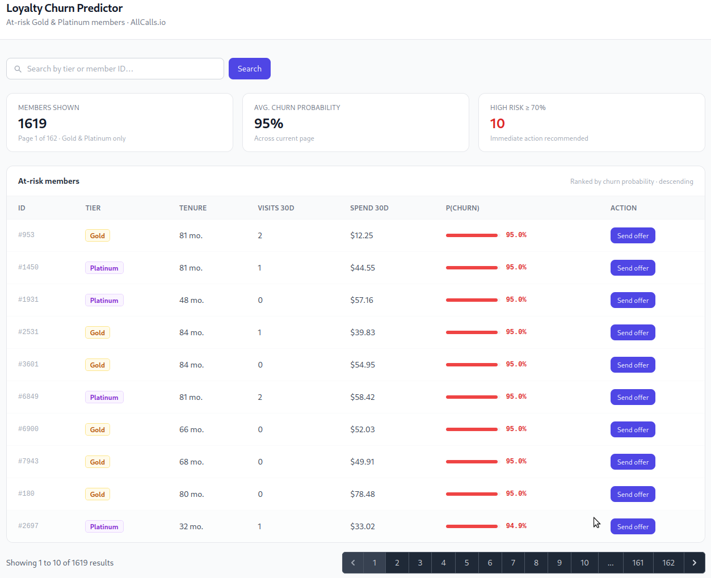

# allcalls-churn-synapcores

A Laravel 13 application that integrates with **SynapCores AIDB** to predict loyalty-member churn. It seeds 8,000 synthetic loyalty-program members with a realistic churn signal, trains a binary-classification model via SynapCores AutoML SQL extensions, and surfaces at-risk Gold/Platinum members on an admin dashboard with one-click retention-offer logging.

---

## Requirements

- PHP ≥ 8.2, Composer
- SynapCores Community Edition running locally
- SQLite (default)

---

## How to run locally

```bash
# 1. Clone & install
git clone https://github.com/eduardoguerrero/allcalls-churn-synapcores.git
cd allcalls-churn-synapcores
composer install

# 2. Configure environment
cp .env.example .env
php artisan key:generate

# Edit .env and set:
#   SYNAPCORES_URL=http://127.0.0.1:8080
#   SYNAPCORES_TIMEOUT=60
#
#   Auth — JWT required:
#      SYNAPCORES_USERNAME=admin
#      SYNAPCORES_PASSWORD=your-password

# 3. Start SynapCores (in a separate terminal)
synapcores

# 4. Migrate & seed (local SQLite only — no SynapCores connection required)
php artisan migrate
php artisan synapcores:seed          # generates 8,000 members in SQLite (~5 s)

# 5. Train the model & score members
php artisan synapcores:train         # AutoML workflow: sync → experiment → predict

# 6. Serve
php artisan serve
# Open http://127.0.0.1:8000/dashboard
```

Pass `--debug` to `synapcores:train` to print raw SynapCores API responses:

```bash
php artisan synapcores:train --debug
```

The JSON API is available without authentication:

```
GET  /api/members/at-risk        → at-risk members as JSON
POST /api/members/{id}/offer     → log a retention offer for a member
```

---

## Architecture — data flow

```
synapcores:seed
  └─► SQLite: loyalty_members (N rows, churn_probability = NULL)
      No SynapCores connection required.

synapcores:train
  ├─► 1. Sync: DROP TABLE / CREATE TABLE / batch INSERT → SynapCores
  ├─► 2. DROP EXPERIMENT IF EXISTS churn_v1
  ├─► 3. CREATE EXPERIMENT churn_v1 AS SELECT … WITH (task_type='binary_classification')
  │       SynapCores CE trains inline and returns best_model_id in the response.
  ├─► 4. PREDICT churn_probability USING churn_v1 AS SELECT id, … FROM loyalty_members
  │
  └─► Normalise scores → [0.05, 0.95]
        → UPDATE loyalty_members SET churn_probability = ?  (dashboard source)
        → INSERT INTO churn_predictions (member_id, churn_probability, scored_at)

Dashboard / API
  └─► SELECT FROM loyalty_members WHERE tier IN ('Gold','Platinum')
      ORDER BY churn_probability DESC

Scheduled job (php artisan schedule:run)
  └─► synapcores:train runs daily → appends a new row to churn_predictions per member
```

---

## `synapcores:train` — AutoML SQL workflow

```sql
-- Step 1: sync data to SynapCores
DROP TABLE IF EXISTS loyalty_members;
CREATE TABLE loyalty_members (id INTEGER PRIMARY KEY, tier TEXT,
    tenure_months INTEGER, visits_30d INTEGER, spend_30d REAL, churned BOOLEAN);
INSERT INTO loyalty_members ...   -- batched via /v1/query/execute/batch

-- Step 2: drop previous experiment for idempotency
DROP EXPERIMENT IF EXISTS churn_v1;

-- Step 3: create experiment — SynapCores CE times out scanning 8000 rows inline, so training
-- is limited to the first 4000 (covers all churn-signal zones). PREDICT scores all 8000.
CREATE EXPERIMENT churn_v1 AS
SELECT tier, tenure_months, visits_30d, spend_30d, churned AS target
FROM loyalty_members
WHERE id <= 4000
WITH (
    task_type           = 'binary_classification',
    target_column       = 'target',
    optimization_metric = 'auc',
    max_trials          = 5,
    time_budget_seconds = 60
);

-- Step 4: score all 8000 members in batches of 1000 — SynapCores CE caps PREDICT results at
-- 1000 rows per response, so the command paginates with WHERE id >= N AND id <= M.
PREDICT churn_probability USING churn_v1
AS SELECT id, tier, tenure_months, visits_30d, spend_30d FROM loyalty_members
WHERE id >= 1 AND id <= 1000;  -- repeated for each 1000-row window
```

Scores are normalised to [0.05, 0.95] before being persisted to SQLite. If any step fails the command exits with a non-zero status — check SynapCores connectivity and re-run.


## Design decisions

- **Custom SDK over a library** — SynapCores doesn't ship a PHP SDK, so `app/Services/SynapCores/` wraps Laravel's built-in HTTP client. `SynapCoresAuth` authenticates exclusively via JWT: `getToken()` calls `POST /v1/auth/login` with `SYNAPCORES_USERNAME` / `SYNAPCORES_PASSWORD` and caches the token in memory for the request lifecycle. On a 401, `SynapCoresClient` calls `refreshToken()` to obtain a fresh JWT and retries the request once; if the retry also fails, the error propagates as `SynapCoresException`. `SynapCoresClient` exposes three SQL methods (`query`, `execute`, `executeAutoML`) and one batch method (`batch`).

- **Single-path AutoML scoring** — `synapcores:train` runs the full AutoML SQL workflow: sync data → `CREATE EXPERIMENT` → `PREDICT`. If any step fails the command exits with a clear error message.

- **`churn_predictions` history table** — Each run of `synapcores:train` appends a timestamped row per member to `churn_predictions`, preserving score history across runs. `loyalty_members.churn_probability` is also updated so the dashboard always reflects the latest score without a join.

- **Singleton registration + Repository pattern** — Both `SynapCoresAuth` and `SynapCoresClient` are singletons in `AppServiceProvider` so auth state is shared across the request lifecycle. Data access is abstracted behind `LoyaltyMemberRepositoryInterface` / `EloquentLoyaltyMemberRepository`, allowing the data source to be swapped without touching controllers or commands.

- **API rate limiting** — API routes are protected with `throttle:api` (60 req/min, keyed by IP) configured in `AppServiceProvider`. The dashboard search input is validated by `DashboardRequest` (FormRequest). The API response is shaped by `LoyaltyMemberResource` (JsonResource).

- **Churn signal design** — The seed data encodes a clear but noisy signal: members with `visits_30d < 2` AND `spend_30d < $20` are labelled churned ~85% of the time; high-activity members churn only ~10%; mid-range ~40%. The ~15% noise prevents a trivially overfit model.

- **SQLite by default** — Eliminates the need for a running database server during evaluation. Switch to MySQL/Postgres by editing `DB_CONNECTION` in `.env`.

- **Blade over Inertia/React** — A working server-rendered table is faster to build and easier to run than a SPA that requires `npm install` and `npm run build`.

---

## Stretch goals

**Daily scheduled refresh** — implemented. `Schedule::command('synapcores:train')->daily()` in `routes/console.php`. Enable with:

```bash
php artisan schedule:run   # or add to crontab: * * * * * php artisan schedule:run
```

**`SELECT GENERATE(...)` personalised offers** — not implemented. The approach would be:

```sql
SELECT id,
    GENERATE('Write a 2-sentence retention offer for a loyalty member with '
        || tenure_months || ' months tenure and $' || spend_30d || ' recent spend.') AS offer
FROM loyalty_members
WHERE tier IN ('Gold', 'Platinum')
ORDER BY churn_probability DESC
LIMIT 50
```

Results would be stored in a `retention_offer TEXT` column on `loyalty_members` and displayed on the dashboard.

---

## What I'd do with more time

- **Personalised retention offers via `SELECT GENERATE(...)`** — use SynapCores SynapCores CE's generative SQL extension to draft a 2-sentence retention offer per at-risk member: `SELECT GENERATE('Write a 2-sentence retention offer for a member with tenure X months and recent spend $Y')`. Store the result in a `retention_offer TEXT` column on `loyalty_members` and surface it on the dashboard alongside the churn score.
- **Dashboard authentication** — `/dashboard` is publicly accessible with no login required. Adding Laravel Breeze would gate it behind an authenticated session and restrict access to admin users via a policy or middleware, preventing any anonymous user from viewing churn scores and member data.
- **Authentication + IDOR fix** — `POST /api/members/{id}/offer` accepts any `member_id` in the table; without an authenticated session there is no way to verify the caller owns the record. Adding Laravel Breeze + Sanctum tokens would allow the controller to check `$request->user()->id === $member->id` (or an admin-only gate) before logging the offer. Today the only effect is a log entry, but if the endpoint were extended to send emails or issue discounts the IDOR would be directly exploitable.
- **SDK test coverage** — mock `SynapCoresClient` with Mockery to cover auth retry, AutoML error parsing, and batch insert paths.
- **Docker** — add `docker-compose.yml` with MySQL so evaluators don't need local PHP.

---

## Where I cut corners

| Corner cut | Why | What I'd do instead |
|---|---|---|
| SynapCores via Docker image | The official installer targets Ubuntu; it failed on my Debian environment. Used the Docker image as a workaround | Use the native installer on a supported Ubuntu host or publish an official Debian package |
| CREATE EXPERIMENT on 4000 of 8000 rows | SynapCores CE times out scanning all 8000 rows inline before training starts | SynapCores CE trains on 4000 rows (half the dataset, covers all churn-signal zones); PREDICT still scores all 8000 via paginated batches of 1000 |
| PREDICT paginated in 1000-row batches | SynapCores CE caps PREDICT results at 1000 rows per response | Ideally SynapCores CE would support a server-side cursor or streaming for large predictions |
| No auth on dashboard/API | Out of scope per spec; adds setup friction | Laravel Breeze + Sanctum tokens |
| IDOR on `POST /api/members/{id}/offer` | No auth layer to tie a session to a member | Require authenticated session; gate on `$request->user()->id === $member->id` or an admin policy |
| Tailwind CDN | Removes the `npm install` step entirely | Vite + Tailwind CLI for production |
| SQLite in local `.env` | Simplest possible setup for evaluators | MySQL with `docker-compose.yml` |

---

## Screenshots

### `php artisan synapcores:seed`
Generates 8,000 synthetic loyalty members in the local SQLite database. No SynapCores connection required.



### `php artisan synapcores:train`
Syncs members to SynapCores, trains the AutoML binary-classification experiment on 4,000 rows, then scores all 8,000 members via paginated PREDICT batches.



### Dashboard — at-risk members
Displays Gold/Platinum members ordered by churn probability, with search and one-click retention-offer logging.



---

## License

MIT
